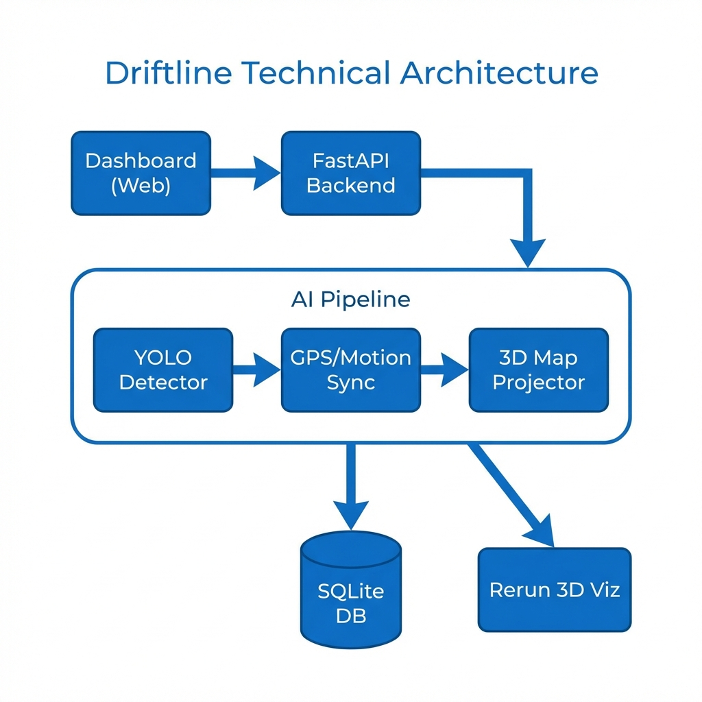
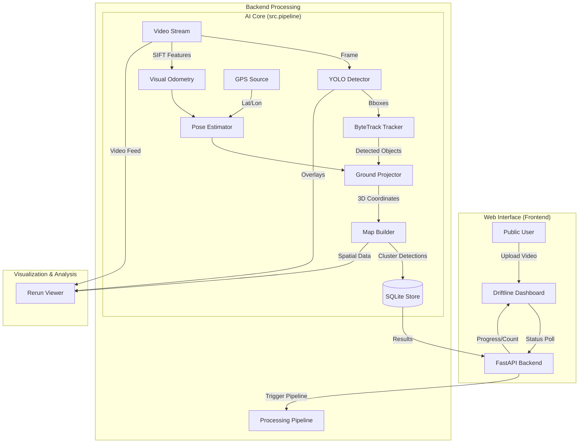

# Driftline Technical Architecture

This document outlines the software architecture and data flow of the **Driftline** platform.

## Tech Stack Overview

| Component | Technology |
| :--- | :--- |
| **Frontend** | HTML5, CSS3, Vanilla JavaScript |
| **Backend** | Python, FastAPI, Uvicorn |
| **AI/ML** | YOLOv8 (Ultralytics), OpenCV |
| **Data Processing** | NumPy, Scikit-learn (DBSCAN clustering) |
| **Visualization** | Rerun SDK |
| **Storage** | SQLite |
| **GPS/Motion** | NMEA Serial, CSV Reader, SIFT-based Visual Odometry |

## Data Flow Diagram

## Key Component Descriptions

### 1. The Detection Pipeline (`src/pipeline.py`)
The heart of the system. It synchronizes video frames with GPS/VO data. For every frame, it runs object detection and projects those detections from "image space" to "world space" using camera intrinsics and vehicle pose.

### 2. Ground Projection (`src/projector.py`)
Calculates where on the road a detected pothole actually is by using a homography-based projection from the camera's perspective to the ground plane.

### 3. Clustering & Mapping (`src/map_builder.py`)
Uses **DBSCAN** to group multiple detections of the same physical hazard across different frames or even different drives into a single "Hazard Event".

### 4. Rerun Integration (`src/viz_rerun.py`)
Provides a high-performance 3D visualization environment where you can see the video feed, the vehicle's path, and detected hazards in a unified space.

### 5. FastAPI Wrapper (`app.py`)
Serves as the bridge between the public-facing web interface and the heavy-duty Python processing code, managing job statuses and file uploads.
